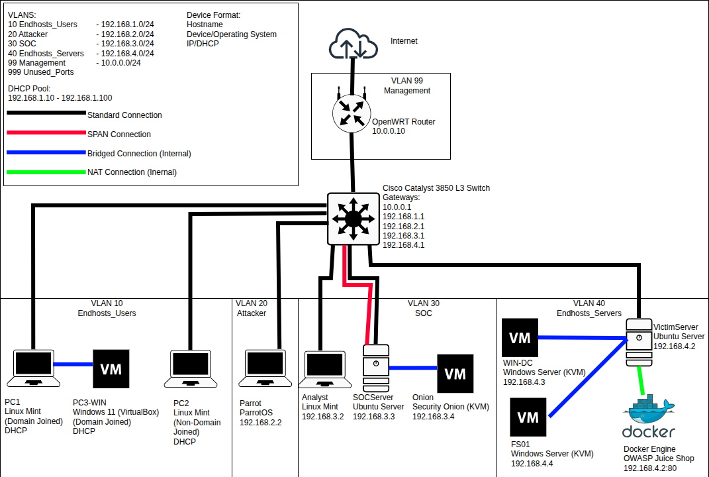

# SOC-homelab

**Objective:** Building and maintaining a partially isolated Security Operations Center (SOC) for gaining hands-on experience with threat detection, incident response, and network security.

**Status:** Active Development | **Last Updated:** August 2026

## Table of Contents
- [Overview](#overview)
- [Infrastructure](#infrastructure)
- [Tools](#tools)
- [Network Diagram](#network-diagram)
- [Security & Isolation Model](#security--isolation-model)
- [Repository Structure](#repository-structure)
- [Incident Response Simulations](#incident-response-simulations)
- [Disclaimer](#disclaimer)


## Overview
This project replicates an enterprise-grade security monitoring environment using an abundance of tools. It ingests logs from endpoints and network traffic into a central SIEM for correlation and alerting. This lab is used to practice **threat hunting**, **incident response**, and **network security**.

**Primary Goals:**
- Centralize log management and threat detection with the use of SIEM.
- Simulate various real-world attacks in an isolated environment to gain hands-on skills on how they work and how to defend against them.
- Secure a small network from attacks by implementing various network security concepts such as segmentation, firewall rules, and ACLs.
- Learn to think like a threat hunter and incident responder.

## Infrastructure
| **Component** | **Device/OS** | **Role** |
| :--- | :--- | :--- |
| **Core Routing** | L3 Cisco Catalyst 3850 Switch | **Networking & Security:** VLAN segmentation, SVI routing, ACLs **SPAN port:** mirrors all incoming traffic from the endhosts and attacker VLANS to the SOC Server. |
| **Gateway Router** | OpenWRT Router | **Nat Gateway:** Provides internet access for installing and updating resources inside the LAN |
| **SOC Server** | Ubuntu Server 26.04 LTS | **Hypervisor:** Hosts Security Onion 2.4 (Standalone) in KVM for log aggregation and threat hunting. |
| **SOC Workstation** | Linux Mint | **Analysis Station:** Connects to Security Onion's web UI. **Management:** Serial console for Switch, SSH/Web UI for OpenWRT |
| **Victim Linux/Web Server** | Ubuntu Server 26.04 LTS | **Hypervisor:** Hosts Windows Server in KVM. **Docker Container:** OWASP Juice Shop |
| **Victim Domain Controller** | Windows Server 2022 | **Core Services:** AD DS, DHCP, DNS, RDP **Logging:** Sysmon |
| **Victim File Server** | Windows Server 2022 | **Core Services:** SMB **Logging:** Sysmon |
| **Victim Linux Endhost 1** | Linux Mint | **Domain Joined:** Joined to Windows Server **VirtualBox:** Runs Windows Endhost. |
| **Victim Linux Endhost 2** | Linux Mint | **Non-Domain Joined:** Standalone environment for non-domain related attacks. |
| **Victim Windows Endhost** | Windows 11 | **Domain Joined:** Joined to Windows Server |
| **Attacker** | ParrotOS | **Red Team:** Performs attacks against Endhosts and Servers |


## Tools

Contains an overview of the various tools and their purpose in this lab.

### Security Operations (Blue Team)
| **Component** | **Tool** | **Role** |
| :--- | :--- | :--- |
| **SIEM** | Elastic Stack | Central log correlation, alerting, and dashboarding |
| **Host Visibility** | Elastic Agent | Endpoint telemetry collection, and live queries (Osquery) |
| **NSM** | Zeek | Network metadata generation, and protocol analysis |
| **NIDS** | Suricata | Intrusion detection and traffic analysis |
| **File Analysis** | Strelka | Scans files extracted from traffic to detect malicious activity |
| **Packet Capture** | Stenographer | Captures and indexes PCAP traffic for forensic retrieval |
| **PCAP Analysis** | Wireshark | Local forensic analysis of raw packets retrieved from Stenographer |
| **Framework** | MITRE ATT&CK | Maps adversary tactics and techniques to classify threats |

## Network Diagram



### Architectural Details
- **Enterprise DHCP Relay:** Assets in VLAN 10 acquire their IP addresses from the **Windows Server 2022 Domain Controller** via Cisco's `ip helper-address` configuration.
- **SPAN/Port Mirroring:** The Cisco switch utilizes a dedicated **SPAN (Switch Port Analyzer)** session to mirror all incoming traffic from VLANs 10, 20, and 40 into **Security Onion's** sniffing interface on VLAN 30. This ensures full packet capture without creating any network bottlenecks.

## Security & Isolation Model
This lab operates under a **strictly controlled connectivity model** to balance functionality with safety.

### 1. Conditional Internet Access
Internet connectivity is **disabled by default** and only enabled temporarily for specific maintenance tasks:
- **Software Updates & Installation:** Permitted on any lab device (Windows Server, Parrot OS, Security Onion).
- **Research & Development:** Restricted **exclusively** to the SOC Analyst PC (accessing GitHub, debugging assistence, closing knowledge gaps).

### 2. Attack Simulation Containment
During active attack simulations, the OpenWrt gateway is **physically disconnected** from the upstream internet. This ensures absolute isolation, guaranteeing that nothing can leave the lab environment.

### 3. Forensic Analysis State
Following an attack simulation, the lab enters a **Forensic Analysis State:**
- **End-Host Shutdown:** All attacker and victim machines are powered off and disconnected.
- **Active Nodes:** Only the **SOC Analyst PC** and **Security Onion** remain online.
- **Benefit:** This creates a noise-free environment, eliminating background chatter (heartbeats, updates) to facilitate precise log correlation, graph generation, and incident documentation.

### 4. Network Perimeter Defense
To prevent external intrusion, the OpenWrt gateway enforces **Outbound NAT with Stateful Inspection:**
- **Outbound:** Internal devices can initiate connections to the internet (when enabled).
- **Inbound:** The stateful firewall **drops** all unsolicited inbound traffic, so no external device can initiate a connection into the lab.

## Repository Structure
```text
SOC-homelab
├── configs/
│   ├── openwrt-config.md
│   └── switch-config.md
├── diagrams/
│   └── network-topology.png
├── incidents/
│   ├── INC-001-Internal-Network-Sweep/
│   │   ├── created-rules/
│   │   ├── elk-screenshots/
│   │   ├── wireshark-screenshots/
│   │   └── INC-001-Internal-Network-Sweep.md
│   └── INC-002-Fileserver-Exfiltration-Campaign/
│       ├── created-rules/
│       ├── elk-screenshots/
│       ├── wireshark-screenshots/
│       └── INC-002-Fileserver-Exfiltration-Campaign.md
└── README.md
```

### Links
[openwrt-config.md](configs/openwrt-config.md)  - Gateway router NAT and remote management rules

[switch-config.md](configs/switch-config.md)    - Cisco VLANs, SVIs, ACLs, SPAN, and full command history

[INC-001-Internal-Network-Sweep.md](incidents/INC-001-Internal-Network-Sweep/INC-001-Internal-Network-Sweep.md) - Full incident Report

[INC-002-Fileserver-Exfiltration-Campaign.md](incidents/INC-002-Fileserver-Exfiltration-Campaign/INC-002-Fileserver-Exfiltration-Campaign.md) - Full incident Report

## Incident Response Simulations
| **Incident ID** | **Title** | **Status** | **MITRE ATT&CK Technique** | **Activity Start (Zeek)** | **Alerts Start (Suricata)** | **Alerts End** | **Activity End** | **Alert Count** | **Connection Count** | **Src IP** | **Target Scope** | **Conclusion** |
|---|---|---|---|---|---|---|---|---|---|---|---|---|
| INC-2026-001 | Internal  Network Sweep | Closed<br>Investigation | T1046 (Discovery) | 2026-07-08<br>14:46:48.797 | 2026-07-08<br>14:46:52.967 | 2026-07-08<br>15:02:03.460 | 2026-07-08<br>15:02:04.518 | 92 | 24,358 | `192.168.2.2` | `192.168.1.0/24`<br>`192.168.4.0/24` | Unauthorized Scan |
| INC-2026-002 | Fileserver<br>Exfiltration Campaign | Closed Investigation | T1046 (Discovery)<br>T1110.001 (Credential Access)<br>T1558.003 (Credential Access)<br>T1110.002 (Credential Access)<br>T1021 (Lateral Movement)<br>T1048.003 (Exfiltration) | 2026-08-12<br>15:17:59.719 | 2026-08-12<br>15:18:01.335 | 2026-08-12<br>15:27:19.493 | 2026-08-12<br>15:28:28.209 | 4,659 | 15,538 | 192.168.2.2 | 192.168.1.12/24<br>192.168.4.3/24<br>192.168.4.4/24 | Unauthorized Scan<br>Kerberoasting<br>Unauthorized Share Access<br>Data Exfiltration |

## Disclaimer
**Disclaimer:** This project is for educational purposes only. All attack simulations were performed in an isolated and controlled environment on my own equipment. 
