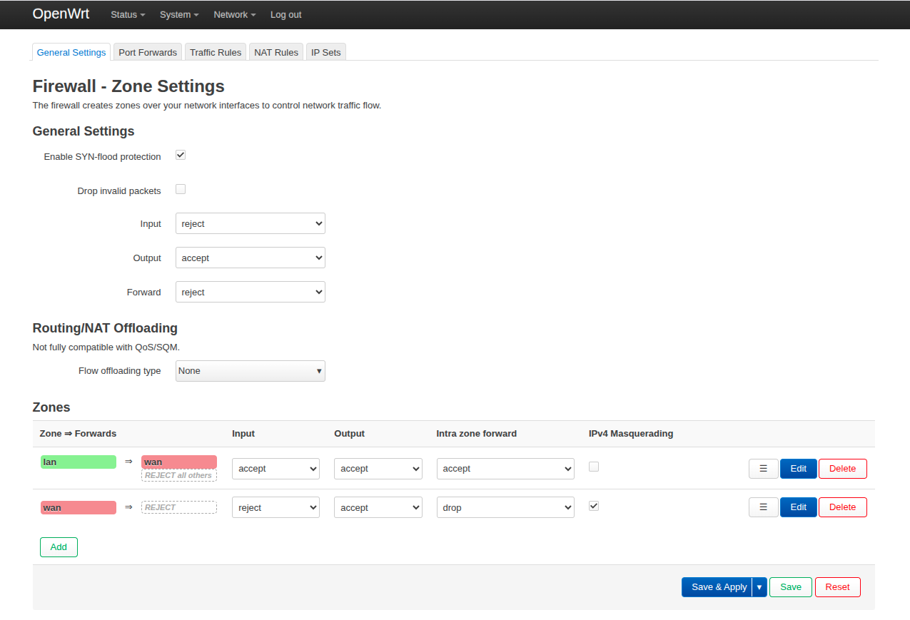
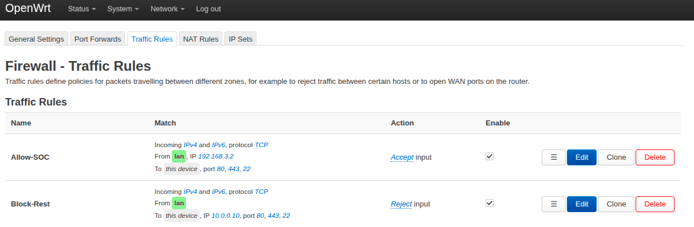

# OpenWRT Firewall Configurations

This file contains visual configurations and zone traffic rules deployed on the OpenWRT gateway to enforce isolation and stateful inspection.

## 1. Traffic Zone Allocations and Source NAT

The OpenWRT router is configured to reject all unsolicited inbound traffic, so nothing can initiate a connection from the outsite. It also is configured for outbound NAT to allow traffic from the inside to form connections outside the environment for updates and installing software.

## 2. Custom Firewall Rules for Remote Management

This rule ensures that only the SOC Analyst PC (`192.168.3.2`) has access for remotely configuring the router. This includes web and ssh access.

