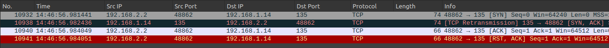
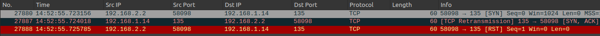
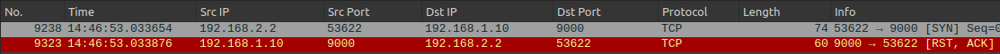
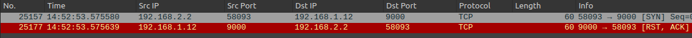
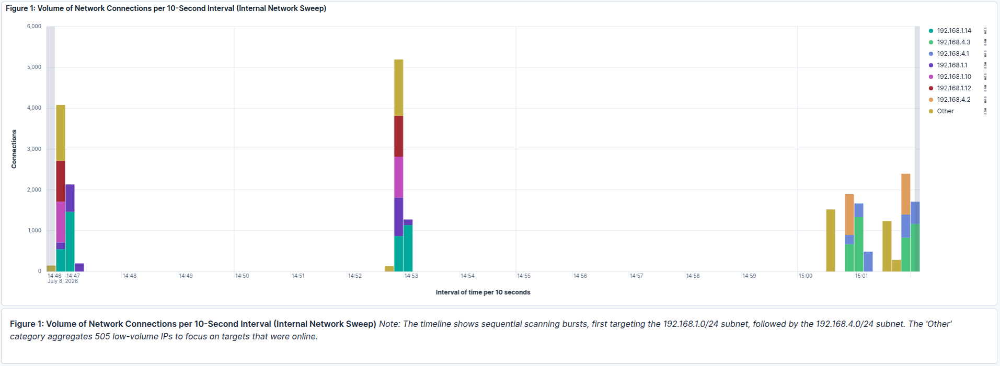
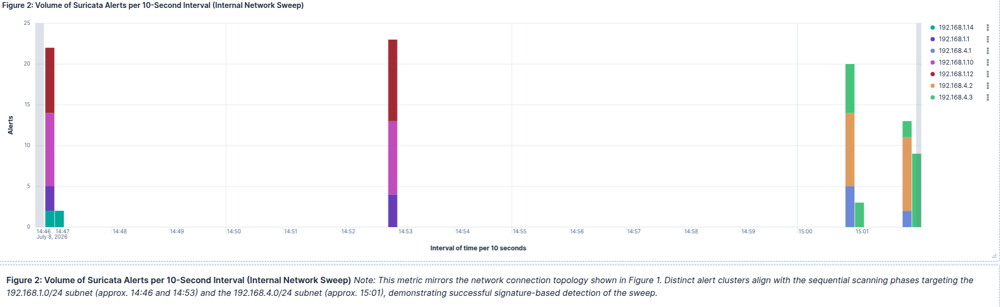
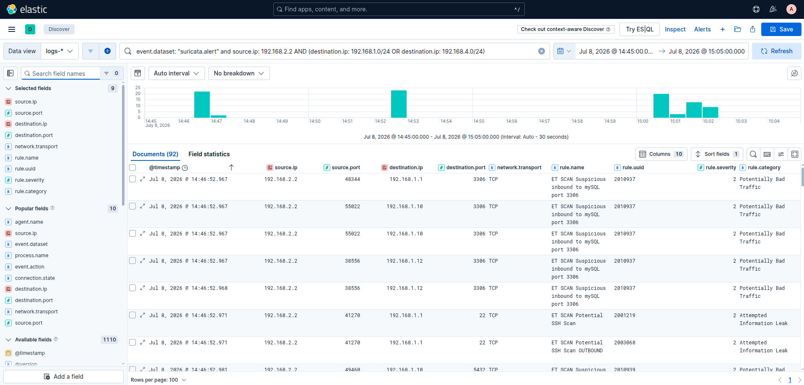
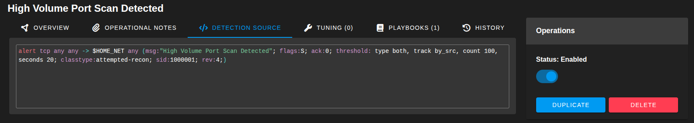
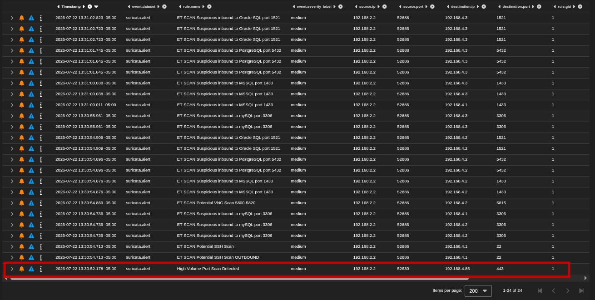

# Incident Triage Report: INC-001-Internal-Network-Sweep

## Table of Contents
- [Section 1 - Executive Summary](#section-1-executive-summary)
- [Section 2 - Executive Summary](#section-2-confirmed-findings)
- [Section 3 - Executive Summary](#section-3-report)
- [Section 4 - Executive Summary](#section-4-legend)
- [Section 5 - Executive Summary](#section-5-ids-remediation-tuning)

## Section 1 - Executive Summary

### Table 1.1 - Summary
| **Attribute** | **Value** |
|---|---|
| **Incident ID** | INC-2026-001 |
| **Title** | Internal  Network Sweep |
| **MITRE ATT&CK  Technique** | T1046 (Discovery) Network Service Discovery |
| **Severity** | Medium / 2 |
| **Source IP** | 192.168.2.2 |
| **Total Connections** | 24,358 |
| **Total Alerts** | 92 |
| **Unique Destinations** | 512 |
| **Unique Destination ports** | 1001 |

### Table 1.2 - Timeframe
| **Activity Start (Zeek)** | **Alerts Start  (Suricata)** | **Alerts End** | **Activity End** | **Activity Pattern** |
|---|---|---|---|---|
| 2026-07-08 14:46:48.797 | 2026-07-08 14:46:52.967 | 2026-07-08  15:02:03.460 | 2026-07-08 15:02:04.518 | 4 bursts |

## Section 2 - Confirmed Findings

### Table 2.1 - Zeek Connection History: Verified Open Ports
| **Phase** | **Time per 100 milliseconds** | **Target IP** | **Port** | **Scan Type** | **Evidence (History)** | **Total Hits** | **Duration** |
|---|---|---|---|---|---|---|---|
| 1 | 14:46:52.900 | 192.168.1.10 | 22 | -sT (Connect) | ShAR | 1 | <1s |
| 1 | 14:46:52.900 | 192.168.1.12 | 22 | -sT (Connect) | ShAR | 1 | <1s |
| 1 | 14:46:52.900 | 192.168.1.1 | 23 | -sT (Connect) | ShAR | 1 | <1s |
| 1 | 14:46:54.300 | 192.168.1.14 | 135 | -sT (Connect) | ShAR | 11 | 13s |
| 1 | 14:46:54.600 | 192.168.1.1 | 22 | -sT (Connect) | ShAR | 1 | <1s |
| 2 | 14:52:53.200 | 192.168.1.1 | 22 | -sS (Stealth) | ShR | 1 | <1s |
| 2 | 14:52:53.200 | 192.168.1.1 | 23 | -sS (Stealth) | ShR | 1 | <1s |
| 2 | 14:52:53.200 | 192.168.1.10 | 22 | -sS (Stealth) | ShR | 1 | <1s |
| 2 | 14:52:53.200 | 192.168.1.12 | 22 | -sS (Stealth) | ShR | 1 | <1s |
| 2 | 14:52:54.400 | 192.168.1.14 | 135 | -sS (Stealth) | ShR | 7 | 8s |
| 3 | 15:00:50.900 | 192.168.4.2 | 22 | -sT (Connect) | ShAR | 1 | <1s |
| 3 | 15:00:50.900 | 192.168.4.2 | 80 | -sT (Connect) | ShAR | 1 | <1s |
| 3 | 15:00:50.900 | 192.168.4.1 | 22 | -sT (Connect) | ShAR | 1 | <1s |
| 3 | 15:00:50.900 | 192.168.4.1 | 23 | -sT (Connect) | ShAR | 1 | <1s |
| 3 | 15:00:50.900 | 192.168.4.3 | 139 | -sT (Connect) | ShAR | 10 | 16s |
| 3 | 15:00:52.100 | 192.168.4.3 | 53 | -sT (Connect) | ShAR | 1 | <1s |
| 3 | 15:00:52.500 | 192.168.4.3 | 445 | -sT (Connect) | ShAR | 1 | <1s |
| 3 | 15:00:52.600 | 192.168.4.3 | 135 | -sT (Connect) | ShAR | 1 | <1s |
| 3 | 15:00:52.900 | 192.168.4.3 | 3268 | -sT (Connect) | ShAR | 1 | <1s |
| 3 | 15:00:53.100 | 192.168.4.3 | 636 | -sT (Connect) | ShAR | 1 | <1s |
| 3 | 15:00:54.800 | 192.168.4.3 | 389 | -sT (Connect) | ShAR | 1 | <1s |
| 3 | 15:01:00.700 | 192.168.4.3 | 3269 | -sT (Connect) | ShAR | 1 | <1s |
| 3 | 15:01:01.000 | 192.168.4.3 | 88 | -sT (Connect) | ShAR | 1 | <1s |
| 3 | 15:01:06.500 | 192.168.4.3 | 464 | -sT (Connect) | ShAR | 1 | <1s |
| 3 | 15:01:06.600 | 192.168.4.3 | 593 | -sT (Connect) | ShAR | 1 | <1s |
| 4 | 15:01:53.900 | 192.168.4.2 | 22 | -sS (Stealth) | ShR | 1 | <1s |
| 4 | 15:01:53.900 | 192.168.4.2 | 80 | -sS (Stealth) | ShR | 1 | <1s |
| 4 | 15:01:53.900 | 192.168.4.1 | 22 | -sS (Stealth) | ShR | 1 | <1s |
| 4 | 15:01:53.900 | 192.168.4.1 | 23 | -sS (Stealth) | ShR | 1 | <1s |
| 4 | 15:01:53.900 | 192.168.4.3 | 53 | -sS (Stealth) | ShR | 1 | <1s |
| 4 | 15:01:53.900 | 192.168.4.3 | 445 | -sS (Stealth) | ShR | 5 | 7s |
| 4 | 15:01:55.100 | 192.168.4.3 | 135 | -sS (Stealth) | ShR | 1 | <1s |
| 4 | 15:01:55.100 | 192.168.4.3 | 139 | -sS (Stealth) | ShR | 1 | <1s |
| 4 | 15:01:59.600 | 192.168.4.3 | 88 | -sS (Stealth) | ShR | 1 | <1s |
| 4 | 15:02:01.600 | 192.168.4.3 | 3269 | -sS (Stealth) | ShR | 1 | <1s |
| 4 | 15:02:02.600 | 192.168.4.3 | 636 | -sS (Stealth) | ShR | 1 | <1s |
| 4 | 15:02:03.000 | 192.168.4.3 | 389 | -sS (Stealth) | ShR | 1 | <1s |
| 4 | 15:02:03.200 | 192.168.4.3 | 464 | -sS (Stealth) | ShR | 1 | <1s |
| 4 | 15:02:03.300 | 192.168.4.3 | 593 | -sS (Stealth) | ShR | 1 | <1s |
| 4 | 15:02:03.300 | 192.168.4.3 | 3268 | -sS (Stealth) | ShR | 1 | <1s |

### Table 2.2 - Suricata Alerts per Target IP
| **Destination IP** | **ET SCAN Suspicious inbound To MSSQL port 1433** | **ET SCAN Suspicious inbound to Oracle SQL port 1521** | **ET SCAN Suspicious inbound To PostgreSQL port 5432** | **ET SCAN Suspicious inbound to mySQL port 3306** | **ET SCAN Potential SSH Scan OUTBOUND** | **ET SCAN Potential VNC Scan 5800-5820** | **ET SCAN Potential SSH Scan** | **Total Alerts** |
|---|---|---|---|---|---|---|---|---|
| 192.168.1.1 | 1 | 1 | 1 | 2 | 1 | 0 | 1 | 7 |
| 192.168.1.10 | 4 | 4 | 4 | 4 | 0 | 2 | 0 | 18 |
| 192.168.1.12 | 4 | 4 | 4 | 4 | 1 | 0 | 1 | 18 |
| 192.168.1.14 | 1 | 1 | 1 | 0 | 1 | 0 | 0 | 4 |
| 192.168.4.1 | 2 | 2 | 0 | 2 | 1 | 0 | 0 | 7 |
| 192.168.4.2 | 4 | 4 | 4 | 4 | 0 | 2 | 0 | 18 |
| 192.168.4.3 | 4 | 4 | 6 | 4 | 1 | 0 | 1 | 20 |
| Total Alerts | 20 | 20 | 20 | 20 | 5 | 4 | 3 | 92 |

### Table 2.3 - Connection States per Target IP
| **Top 10 values of  Destination IP** | **Total Connections** | **REJ (Rejected)** | **REJ%** | **S0 (No Reply)** | **S0%** | **RSTO (Reset)** | **RSTO%** | **OTH  (Other)** | **OTH%** | **Interpretation** |
|---|---|---|---|---|---|---|---|---|---|---|
| 192.168.1.14 | 4016 | 0 | 0.0% | 3996 | 99.5% | 18 | 0.4% | 2 | 0.1% | High S0 count indicates SYN Scan (-sS) |
| 192.168.4.3 | 3993 | 0 | 0.0% | 3956 | 99.1% | 35 | 0.9% | 2 | 0.1% |  |
| 192.168.4.1 | 2165 | 1996 | 92.2% | 164 | 7.6% | 4 | 0.2% | 1 | 0.0% | High REJ count indicates TCP Connect Scan (-sT) With many closed ports. |
| 192.168.1.1 | 2118 | 1996 | 94.2% | 116 | 5.5% | 4 | 0.2% | 2 | 0.1% |  |
| 192.168.1.10 | 2002 | 1998 | 99.8% | 0 | 0.0% | 2 | 0.1% | 2 | 0.1% |  |
| 192.168.1.12 | 2002 | 1998 | 99.8% | 0 | 0.0% | 2 | 0.1% | 2 | 0.1% |  |
| 192.168.4.2 | 2002 | 1996 | 99.7% | 0 | 0.0% | 4 | 0.2% | 2 | 0.1% |  |
| 192.168.4.59 | 12 | 0 | 0.0% | 4 | 33.3% | 0 | 0.0% | 8 | 66.7% | Low connection count indicates Offline hosts. |
| 192.168.1.24 | 10 | 0 | 0.0% | 4 | 40.0% | 0 | 0.0% | 6 | 60.0% |  |
| 192.168.1.89 | 10 | 0 | 0.0% | 4 | 40.0% | 0 | 0.0% | 6 | 60.0% |  |
| Other 502 IP Addresses | 6024 | 0 | 0.0% | 2008 | 33.3% | 0 | 0.0% | 4016 | 66.7% |  |
| Total  | 24354 | 9984 |  | 10252 |  | 69 |  | 4049 |  |  |

### Screenshot 2.1 - Wireshark Capture of Open Port During *TCP Connect Scan*

### Screenshot 2.2 - Wireshark Capture of Open Port during *SYN Scan*

### Screenshot 2.3 - Wireshark Capture of Closed Port during *TCP Connection Scan*

### Screenshot 2.3 - Wireshark Capture of Closed Port during *SYN Scan*

### Graph 2.1 - Volume of Network Connections per 10-Second Interval

### Graph 2.2 - Volume of Suricata Alerts per 10-Second Interval

### Graph 2.3 - Volume of Network Connections per 500-Millisecond Interval Phase 1

### Dashboard 2.1 - Zeek Capture Search
[!Zeek Capture Search](elk-screenshots/zeek-capture-search.png)

### Dashboard 2.2 - Suricata Alert Search

### Methodology Notes
| **Query Type** | **Query** |
|---|---|
| **Suricata Alert Query** | event.dataset: suricata.alert and source.ip: 192.168.2.2 and (destination.ip: 192.168.1.0/24 OR destination.ip: 192.168.4.0/24) |
| **Zeek Connection Query** | event.dataset: zeek.conn and source.ip: 192.168.2.2 and (destination.ip: 192.168.1.0/24 OR destination.ip: 192.168.4.0/24) |

## Section 3 - Report

### Attack Methodology & Technique
The incident involved a reconnaissance scan utilizing both TCP Connect (-sT) and SYN Stealth (-sS) techniques. The attacker segmented the attack into four distinct phases:	
**Phase 1 & 3 (Connect Scan):** Used against 192.168.1.0/24 and 192.168.4.0/24 subnets to identify open ports via full handshakes (ShAR)
**Phase 2 & 4 (Stealth Scan):** Switched to stealth techniques (Shr) roughly 6 minutes later, likely to evade basic logging or test detection capabilities on previously identified targets.
**Precision:** The scan targeted the 1,000 most common ports.

### Attacker Intent & Targeting
**Identified Services:** The attacker successfully identified open ports for Microsoft RPC (135), SMB (445), LDAP (389), and Global Catalog (3268) on 192.168.4.3 and SSH (22) from multiple devices on the 192.168.1.0/24 subnet
**Database Hunting:** Suricata alerts confirmed probes against MSSQL (1433), MySQL (3306), and SSH (22) across the network.
**Lateral Movement Prep:** Successful enumeration of SSH (22) and Telnet (23) on multiple hosts provides the attacker with potential entry points for brute-force attacks.

### Detection Gap Analysis
**The Blind Spot:** While Zeek logged 24,000+ connection attempts across 1,000 ports, Suricata generated only 92 alerts for 8 specific ports. This means that the incident had a 0.8% port coverage.
**Reason:** The default Emerging Threats (ET) only alerts on specific high value ports (SQL, SSH). Scans against common web ports (80, 443) and other services went undetected by the IDS.
**Impact:** Without correlating Zeek conn.log data, the SOC would have underestimated the scan scope by 99.2%, believing only database and SSH port were targeted. If a port scan were to occur that does not contain the 8 specific ports, it would remain undetected.

### Conclusion
The attacker successfully mapped open ports and services from the 192.168.1.0/24 and 192.168.4.0/24 subnets, most of which remained undetected by the IDS. Immediate remediation and tuning of scan detection rules are required.

## Section 4 - Legend

### Table 4.1 - Connection State legend
| **Name** | **State** | **Indication** |
|---|---|---|
| REJ (Rejected) | Closed Port | TCP Connect (-sT) |
| S0 (No Reply) | Closed/Filtered Port | SYN Scan (-sS) |
| RSTO (Reset) | Open Port | TCP Connect (-sT) |
| OTH (Other) | Noise/Error | N/A (Artifact) |

### Table 4.2 - Connection History Legend
| **Name** | **Flags** | **Indication** |
|---|---|---|
| Sr | SYN (send) RST (receive) | Closed port |
| S | SYN (send) | Dropped or host offline |
| A | ACK (send) | Host Discovery probes |
| ShR | SYN (send), SYN-ACK(receive), RST(send) | nmap -sS (Open Port) |
| ShAR | SYN (send), SYN-ACK(receive), ACK(send), RST(send) | nmap -sT (Open Port) |

## Section 5 - IDS Remediation & Tuning

### Custom Suricata Rule
**Objective:** Enhance port scan detection by shifting from signature-based detection (limited to specific ports) to behavioral-based detection. The goal is to identify high-volume scanning across any port range while maintaining near-zero false positive rate.

**Rule Creation:** Deployed and enabled a new behavioral-based Suricata rule to detect high rate of SYN packets (100 over 20 seconds) from any incoming IP address.
**Validation Test:** Tested new rule while re-simulating the attack again under similar conditions. 
**Challenges Faced:** The primary challenge was balancing detection sensitivity with alert volume. Early revised rules generated thousands of alerts, and false positives.

**Revision 1:** The first revision consisted of multiple behavioral rules that attempted to match specific TCP flag sequences (SYN, SYN-ACK, RST/RST-ACK). This failed because legitimate Windows services mimic these sequences, causing high false positives. Furthermore, the rule alerted on every individual packet (open or closed port), generating thousands of alerts for a single subnet scan.
**Revision 2:** To circumvent false positives, the next revision used just 1 rule instead of multiple, and adopted a simpler approach to filter based on packet rate and SYN flags, rather than attempting to correlate complete TCP flag sequences. The rule used “detection\_filter:track by\_src, count 20, seconds 5;”, which still created thousands of alerts. This is because “detection\_filter” triggers an alert for each packet after the threshold is met, not just once. Although it creates a high detection rate, it is operationally inefficient.
**Revision 3:** To reduce alert volume, “threshold: type both, track by\_src, count 20, seconds 5;” was used instead of “detection\_filter”. It successfully reduced alert volume from thousands, to just 1 or 2 per scan. However, the current threshold (20 packets/5 seconds) still triggered false positives from busy web traffic.
**Revision 4(Final):** Tuned the threshold to 100 packets over a time period of 20 seconds, which resulted in zero false positives during testing and coverage for both horizontal (subnet) and vertical (multi-port) scans.

### Screenshot 5.1 - Custom Rule

### Screenshot 5.2 - Custom Rule in Action

### Table 5.1 - Optimization Analysis: Default Ruleset vs. Custom Behavioral Rule
| **Feature** | **8 ET SCAN Signature Rules** | **Custom Rule** | **Operational Impact  Of New Rule** |
|---|---|---|---|
| **Detection Logic** | Signature-Based: Triggers only with specific ports (3306, 1433, 22). | Behavior-Based: triggers on volume threshold regardless of port. | Closes Evasion Gaps: Detects scans targeting non-standard ports that default rules miss. |
| **Rule Count** | Fragmented: 8 separate rules to cover 8 common services (SSH, VNC, SQL) | Consolidated: Single rule covers all 65,535 TCP ports | Simplified Management: One rule to tune and maintain instead of a list of specific ports. |
| **Alert Volume** | High: Generated 23 alerts for 1 subnet scan with 7 online hosts. | Low: Generates 1-2 alerts per scanning session regardless if hosts are online. | Reduced Fatigue: Analysts see one event instead of a flood of logs |
| **False Positives** | Medium Confidence: Contains threshold of 5 connections, but legitimate admin access to DB/SSH ports can trigger alert. | High Confidence: ignores low-volume legitimate traffic. | Higher Signal: Alerts are more likely to represent true positives. |
| **Coverage Scope** | Limited: Only detects scans hitting 8 specified ports | Comprehensive: Detects any scan generating sufficient volume, even on obscure ports. | Robust Defense: Relies on packet volume rather than 1 port. |
| **Primary Use Case** | Target Identification: Informs what services is being scanned for. | Event Detection: Informs that a scan is happening. | Proactive Detection: Identifies reconnaissance phase regardless of the attacker’s target list |

### Conclusion
**Conclusion:** Initial rules were focused on specific ports, instead of looking for volume of connections. Consequently, scans targeting non-standard ports would bypass detection entirely. The new behavioral rule successfully detect scans based on detection volume, ensuring full port coverage.

