# Incident Triage Report: INC-002-Fileserver-Exfiltration-Campaign

## Table of Contents
- [Section 1 - Executive Summary](#section-1---executive-summary)
- [Section 2 - Confirmed Findings](#section-2---confirmed-findings)
- [Section 3 - Report](#section-3---report)
- [Section 4 - Legend](#section-4---legend)
- [Section 5 - IDS Remediation & Tuning](#section-5---ids-remediation--tuning)

## Section 1 - Executive Summary

### Table 1.1 - Summary
| **Attribute** | **Value** |
|---|---|
| **Incident ID** | INC-2026-002 |
| **Title** | Fileserver Exfiltration Campaign |
| **MITRE ATT&CK  Technique** | T1046 (Discovery) Network Service Discovery T1110.001 (Credential Access) Brute Force: Password Guessing T1558.003 (Credential Access) Steal or Force Kerberos Tickets: Kerberoasting T1110.002 (Credential Access) Brute Force: Password Cracking T1021 (Lateral Movement) Remote Services T1048.003 (Exfiltration) Exfiltration Over Alternative Protocol: Exfiltration Over Unencrypted Non-C2 Protocol |
| **Severity** | Medium / 2 |
| **Source IP** | 192.168.2.2 |
| **Total Connections** | 15,538 |
| **Total Alerts** | 4,659 |

### Table 1.2 - Timeframe
| **Activity Start (Zeek)** | **Alerts Start  (Suricata)** | **Alerts End** | **Activity End** |
|---|---|---|---|
| 2026-08-12 15:17:59.719 | 2026-08-12 15:18:01.335 | 2026-08-12 15:27:19.493 | 2026-08-12 15:28:28.209 |

## Section 2 - Confirmed Findings

### Table 2.1 – Suricata Alerts: Full History
Full list of Suricata alerts during the incident which signals for possible scanning, RDP brute force, kerberoasting, and lateral movement.

| **Time per Minute** | **Source IP** | **Destination IP** | **Rule Name** | **Count of Records** |
|---|---|---|---|---|
| 15:18 | 192.168.2.2 | 192.168.4.4 | ET SCAN Suspicious inbound to MSSQL port 1433 | 2 |
| 15:18 | 192.168.2.2 | 192.168.4.4 | ET SCAN Suspicious inbound to Oracle SQL port 1521 | 2 |
| 15:18 | 192.168.2.2 | 192.168.4.4 | ET SCAN Suspicious inbound to PostgreSQL port 5432 | 2 |
| 15:18 | 192.168.2.2 | 192.168.4.4 | ET SCAN Suspicious inbound to mySQL port 3306 | 1 |
| 15:18 | 192.168.2.2 | 192.168.4.4 | High Volume Port Scan Detected | 1 |
| 15:18 | 192.168.2.2 | 192.168.4.3 | ET SCAN Suspicious inbound to mySQL port 3306 | 2 |
| 15:18 | 192.168.2.2 | 192.168.4.3 | ET SCAN Potential SSH Scan | 1 |
| 15:18 | 192.168.2.2 | 192.168.4.3 | ET SCAN Potential SSH Scan OUTBOUND | 1 |
| 15:18 | 192.168.2.2 | 192.168.4.3 | ET SCAN Suspicious inbound to MSSQL port 1433 | 1 |
| 15:18 | 192.168.2.2 | 192.168.4.3 | ET SCAN Suspicious inbound to Oracle SQL port 1521 | 1 |
| 15:18 | 192.168.2.2 | 192.168.4.3 | ET SCAN Suspicious inbound to PostgreSQL port 5432 | 1 |
| 15:18 | 192.168.2.2 | 192.168.4.2 | ET SCAN Potential VNC Scan 5800-5820 | 1 |
| 15:18 | 192.168.2.2 | 192.168.4.2 | ET SCAN Suspicious inbound to MSSQL port 1433 | 1 |
| 15:18 | 192.168.2.2 | 192.168.4.2 | ET SCAN Suspicious inbound to Oracle SQL port 1521 | 1 |
| 15:18 | 192.168.2.2 | 192.168.4.2 | ET SCAN Suspicious inbound to PostgreSQL port 5432 | 1 |
| 15:18 | 192.168.2.2 | 192.168.4.2 | ET SCAN Suspicious inbound to mySQL port 3306 | 1 |
| 15:18 | 192.168.2.2 | 192.168.4.1 | ET SCAN Suspicious inbound to MSSQL port 1433 | 1 |
| 15:18 | 192.168.2.2 | 192.168.4.1 | ET SCAN Suspicious inbound to Oracle SQL port 1521 | 1 |
| 15:18 | 192.168.2.2 | 192.168.4.1 | ET SCAN Suspicious inbound to PostgreSQL port 5432 | 1 |
| 15:18 | 192.168.2.2 | 192.168.4.1 | ET SCAN Suspicious inbound to mySQL port 3306 | 1 |
| 15:18 | 192.168.2.2 | 192.168.4.82 | High Volume Port Scan Detected | 1 |
| 15:19 | 192.168.2.2 | 192.168.1.12 | ET SCAN Suspicious inbound to MSSQL port 1433 | 2 |
| 15:19 | 192.168.2.2 | 192.168.1.12 | ET SCAN Suspicious inbound to Oracle SQL port 1521 | 2 |
| 15:19 | 192.168.2.2 | 192.168.1.12 | ET SCAN Suspicious inbound to PostgreSQL port 5432 | 2 |
| 15:19 | 192.168.2.2 | 192.168.1.12 | ET SCAN Suspicious inbound to mySQL port 3306 | 2 |
| 15:19 | 192.168.2.2 | 192.168.1.12 | ET SCAN Behavioral Unusually fast Terminal Server Traffic Potential Scan or Infection (Inbound) | 1 |
| 15:19 | 192.168.2.2 | 192.168.1.12 | ET SCAN Behavioral Unusually fast Terminal Server Traffic Potential Scan or Infection (Outbound) | 1 |
| 15:19 | 192.168.2.2 | 192.168.1.12 | ET SCAN Potential SSH Scan OUTBOUND | 1 |
| 15:19 | 192.168.2.2 | 192.168.1.12 | High Volume Port Scan Detected | 1 |
| 15:19 | 192.168.2.2 | 192.168.1.10 | ET SCAN Potential VNC Scan 5800-5820 | 1 |
| 15:19 | 192.168.2.2 | 192.168.1.10 | ET SCAN Suspicious inbound to MSSQL port 1433 | 1 |
| 15:19 | 192.168.2.2 | 192.168.1.10 | ET SCAN Suspicious inbound to Oracle SQL port 1521 | 1 |
| 15:19 | 192.168.2.2 | 192.168.1.10 | ET SCAN Suspicious inbound to PostgreSQL port 5432 | 1 |
| 15:19 | 192.168.2.2 | 192.168.1.10 | ET SCAN Suspicious inbound to mySQL port 3306 | 1 |
| 15:19 | 192.168.2.2 | 192.168.1.1 | ET SCAN Suspicious inbound to MSSQL port 1433 | 1 |
| 15:19 | 192.168.2.2 | 192.168.1.1 | ET SCAN Suspicious inbound to Oracle SQL port 1521 | 1 |
| 15:19 | 192.168.2.2 | 192.168.1.1 | ET SCAN Suspicious inbound to PostgreSQL port 5432 | 1 |
| 15:19 | 192.168.2.2 | 192.168.1.1 | ET SCAN Suspicious inbound to mySQL port 3306 | 1 |
| 15:19 | 192.168.2.2 | 192.168.1.78 | High Volume Port Scan Detected | 1 |
| 15:20 | 192.168.1.12 | 192.168.2.2 | ET INFO RDP - Response To External Host | 210 |
| 15:21 | 192.168.1.12 | 192.168.2.2 | ET INFO RDP - Response To External Host | 1144 |
| 15:21 | 192.168.2.2 | 192.168.1.12 | High Volume Port Scan Detected | 3 |
| 15:21 | 192.168.2.2 | 192.168.1.12 | ET SCAN Behavioral Unusually fast Terminal Server Traffic Potential Scan or Infection (Inbound) | 1 |
| 15:21 | 192.168.2.2 | 192.168.1.12 | ET SCAN Behavioral Unusually fast Terminal Server Traffic Potential Scan or Infection (Outbound) | 1 |
| 15:22 | 192.168.1.12 | 192.168.2.2 | ET INFO RDP - Response To External Host | 1102 |
| 15:22 | 192.168.2.2 | 192.168.1.12 | High Volume Port Scan Detected | 3 |
| 15:23 | 192.168.1.12 | 192.168.2.2 | ET INFO RDP - Response To External Host | 1118 |
| 15:23 | 192.168.2.2 | 192.168.1.12 | High Volume Port Scan Detected | 3 |
| 15:24 | 192.168.1.12 | 192.168.2.2 | ET INFO RDP - Response To External Host | 1020 |
| 15:24 | 192.168.2.2 | 192.168.1.12 | High Volume Port Scan Detected | 3 |
| 15:25 | 192.168.2.2 | 192.168.4.3 | ET EXPLOIT Possible GoldenPac Priv Esc in-use | 1 |
| 15:27 | 192.168.2.2 | 192.168.4.4 | ET INFO NTLM Session Setup Request - Auth | 1 |
| 15:27 | 192.168.2.2 | 192.168.4.4 | ET INFO NTLM Session Setup Request - Negotiate | 1 |
| 15:27 | 192.168.4.4 | 192.168.2.2 | ET INFO NTLMv1 Session Setup Response - Challenge | 1 |
| **Total** | - | - | - | **4659** |

### Table 2.2 – Zeek Connection History: Verified Open Ports
Enumeration of active network services on target hosts (192.168.4.3, 192.168.4.4, 192.168.1.10, 192.168.1.12) mapped by the attacker (192.168.2.2).

| **Source IP** | **Destination IP** | **Connection History** | **Destination Port** | **Count of Connection History** |
|---|---|---|---|---|
| 192.168.2.2 | 192.168.4.3 | ShR | 135 | 6 |
| 192.168.2.2 | 192.168.4.3 | ShR | 53 | 1 |
| 192.168.2.2 | 192.168.4.3 | ShR | 88 | 1 |
| 192.168.2.2 | 192.168.4.3 | ShR | 139 | 1 |
| 192.168.2.2 | 192.168.4.3 | ShR | 389 | 1 |
| 192.168.2.2 | 192.168.4.3 | ShR | 445 | 1 |
| 192.168.2.2 | 192.168.4.3 | ShR | 464 | 1 |
| 192.168.2.2 | 192.168.4.3 | ShR | 593 | 1 |
| 192.168.2.2 | 192.168.4.3 | ShR | 636 | 1 |
| 192.168.2.2 | 192.168.4.3 | ShR | 3268 | 1 |
| 192.168.2.2 | 192.168.4.3 | ShR | 3269 | 1 |
| 192.168.2.2 | 192.168.4.4 | ShR | 135 | 11 |
| 192.168.2.2 | 192.168.4.4 | ShR | 139 | 1 |
| 192.168.2.2 | 192.168.4.4 | ShR | 445 | 1 |
| 192.168.2.2 | 192.168.1.12 | ShR | 3389 | 8 |
| 192.168.2.2 | 192.168.1.12 | ShR | 135 | 1 |
| 192.168.2.2 | 192.168.1.10 | ShR | 22 | 1 |
| 192.168.2.2 | 192.168.4.2 | ShR | 22 | 1 |
| **Total** | - | - | - | **40** |

### Table 2.3 – Port Scan Activity and Connection History
Traffic analysis of the scan shows the attacker most likely used a SYN scan on 2 subnets (192.168.1.0/24 and 192.168.4.0/24) 

| **Source IP** | **Destination IP** | **Connection History** | **Count of Connection History** |
|---|---|---|---|
| 192.168.2.2 | 192.168.4.4 | S | 1994 |
| 192.168.2.2 | 192.168.4.4 | ShR | 13 |
| 192.168.2.2 | 192.168.1.12 | S | 1996 |
| 192.168.2.2 | 192.168.1.12 | ShR | 9 |
| 192.168.2.2 | 192.168.4.3 | S | 1978 |
| 192.168.2.2 | 192.168.4.3 | ShR | 16 |
| 192.168.2.2 | 192.168.1.1 | S | 1099 |
| 192.168.2.2 | 192.168.1.1 | SR | 2 |
| 192.168.2.2 | 192.168.4.1 | S | 1088 |
| 192.168.2.2 | 192.168.4.1 | SR | 2 |
| 192.168.2.2 | 192.168.1.10 | Sr | 999 |
| 192.168.2.2 | 192.168.1.10 | ShR | 1 |
| 192.168.2.2 | 192.168.4.2 | Sr | 999 |
| 192.168.2.2 | 192.168.4.2 | ShR | 1 |
| 192.168.2.2 | Other | A | 983 |
| 192.168.2.2 | Other | S | 935 |
| **Total** | - | - | **12115** |

### Table 2.4 – RDP Brute Force, Kerberos Events, and Share Access
Successful RDP (port 3389) brute force against the target 192.168.1.12, followed by a kerberos ticket request and a network share access.

| **Time per 30 seconds** | **Source IP** | **Event Code** | **Event Action** | **Hostname** | **Destination IP** | **Username** | **Count of Actions** |
|---|---|---|---|---|---|---|---|
| 15:20:30 | 192.168.2.2 | 4625 | logon-failed | PC3-WIN | 192.168.1.12 | user | 1 |
| 15:21:00 | 192.168.2.2 | 4625 | logon-failed | PC3-WIN | 192.168.1.12 | Various (many) | 274 |
| 15:21:30 | 192.168.2.2 | 4625 | logon-failed | PC3-WIN | 192.168.1.12 | Various (many) | 280 |
| 15:22:00 | 192.168.2.2 | 4625 | logon-failed | PC3-WIN | 192.168.1.12 | Various (many) | 289 |
| 15:22:30 | 192.168.2.2 | 4625 | logon-failed | PC3-WIN | 192.168.1.12 | Various (many) | 269 |
| 15:23:00 | 192.168.2.2 | 4625 | logon-failed | PC3-WIN | 192.168.1.12 | Various (many) | 274 |
| 15:23:30 | 192.168.2.2 | 4625 | logon-failed | PC3-WIN | 192.168.1.12 | Various (many) | 281 |
| 15:24:00 | 192.168.2.2 | 4625 | logon-failed | PC3-WIN | 192.168.1.12 | Various (many) | 278 |
| 15:24:30 | 192.168.2.2 | 4625 | logon-failed | PC3-WIN | 192.168.1.12 | Various (many) | 279 |
| 15:25:00 | 192.168.2.2 | 4625 | logon-failed | PC3-WIN | 192.168.1.12 | Various (many) | 70 |
| 15:25:00 | 192.168.2.2 | 4624 | logged-in | PC3-WIN | 192.168.1.12 | adoe | 1 |
| 15:26:00 | 192.168.2.2 | 4624 | logged-in | WIN-DC | 192.168.4.3 | adoe | 1 |
| 15:26:00 | 192.168.2.2 | 4768 | kerberos-authentication-ticket-requested | WIN-DC | 192.168.4.3 | adoe | 1 |
| 15:26:00 | 192.168.2.2 | 4769 | kerberos-service-ticket-requested | WIN-DC | 192.168.4.3 | adoe | 1 |
| 15:27:00 | 192.168.2.2 | 4624 | logged-in | FS01 | 192.168.4.4 | svc\_fileserver | 1 |
| 15:27:00 | 192.168.2.2 | 5140 | network-share-object-accessed | FS01 | 192.168.4.4 | svc\_fileserver | 2 |
| 15:28:00 | 192.168.2.2 | 4624 | logged-in | FS01 | 192.168.4.4 | svc\_fileserver | 1 |
| 15:28:00 | 192.168.2.2 | 5140 | network-share-object-accessed | FS01 | 192.168.4.4 | svc\_fileserver | 2 |
| **Total** | - | - | - | - | - | - | **2305** |

### Screenshot 2.1 – Wireshark Capture of Kerberoasting
This capture shows the kerberoasting attack, where the attacker initially enumerates the domain controller using the stolen credentials of the user 'adoe' (Alice Doe) to search for service accounts. Once the "svc\_fileserver" account was found, the pre-authentication (AS-REQ and AS-REP). The kerberoasting event occrurs when the ticket request was made and granted (TGS-REQ and TGS-REP), and the attacker is able to crack the hash offline.

### Screenshot 2.2 – TGS-REP Packet Indicative of Kerberosting
This capture shows the details of the TGS-REP packet for the "svc\_fileserver" service account. Additionally, the hash type uses RC4 (etype 23), which is commonly associated with Kerberoasting and can enable offline password cracking attempts against the service account.

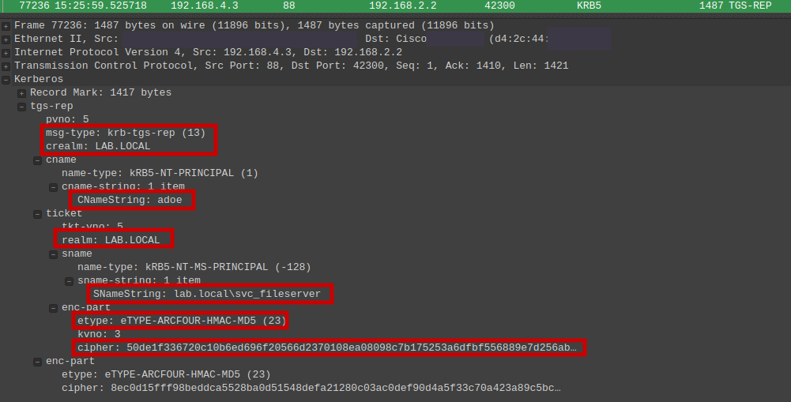

### Table 2.5 – Share Access and Exfiltration
This capture shows 20MB of data going outbound to the attacker from the fileserver share signifying data exfiltration.

| **Time per Second** | **Source IP** | **Source Port** | **Destination IP** | **Destination Port** | **Source Bytes (Inbound)** | **Share Name** | **Destination Bytes (Outbound)** | **Event Duration** |
|---|---|---|---|---|---|---|---|---|
| 15:27:19 | 192.168.2.2 | 45456 | 192.168.4.4 | 445 | 0B | \C:\Data | 0B | < 1 second |
| 15:28:02 | 192.168.2.2 | 39086 | 192.168.4.4 | 445 | 6.6KB | \C:\Data | 20MB | 26 seconds |

### Screenshot 2.3 – Wireshark Capture of SMB Authentication and Lateral Movement
This capture shows the attacker sucessfully authenticated to the 'Data' share on the fileserver (192.168.4.4) with the 'svc\_fileserver' credentials obtained via kerberoasting signifying lateral movement.

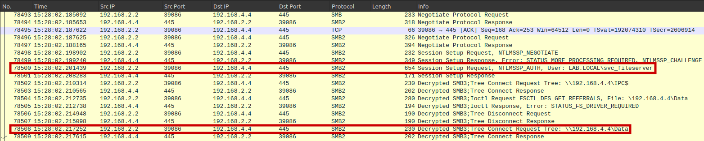

### Screenshot 2.4 – Wireshark Capture of SMB Directory Enumeration
This capture shows the attacker requesting for the contents of the backup directory.

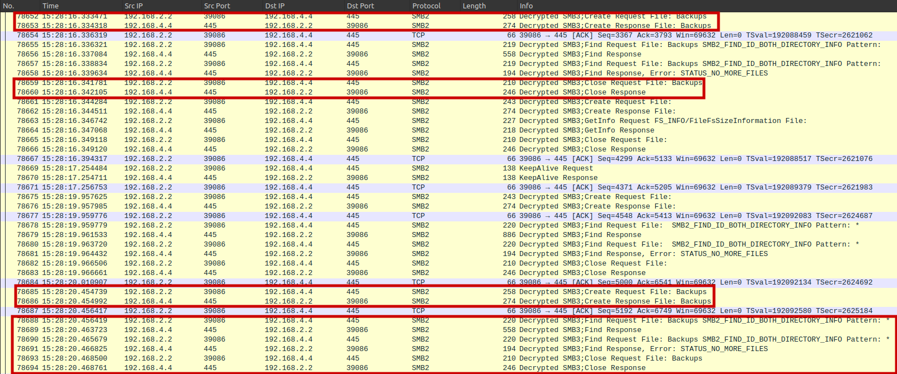

### Screenshot 2.5 – Wireshark Capture of SMB File Request 1 and 2
This capture shows the atttacker requesting for the 'Important\_Info.txt' file, showing the attacker's intent of data exfiltration.

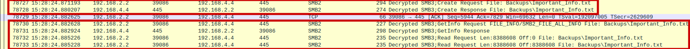

### Screenshot 2.6 – Wireshark Capture of SMB File Request 3
This capture shows the third request of the 'Important\_Info.txt' file.

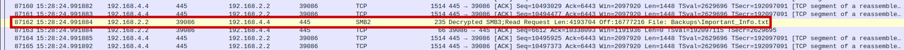

### Screenshot 2.7 – Wireshark Capture of SMB Connection Termination
This capture shows the request for the file 'Important\_Info.txt' closing, and the SMB connection termination, showing the end of the data exfiltration attack.

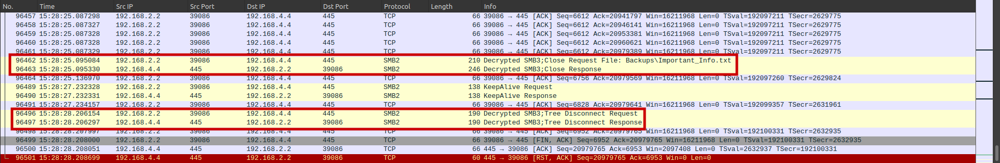

### Dashboard 2.1 - Zeek Capture Search
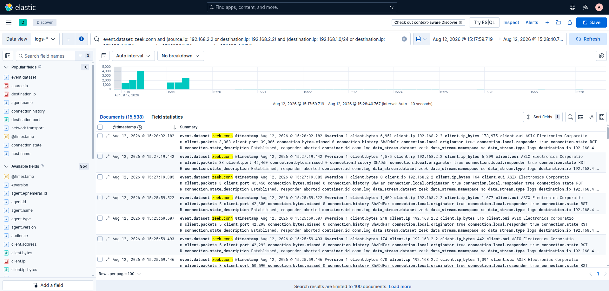

### Dashboard 2.2 - Suricata Alert Search
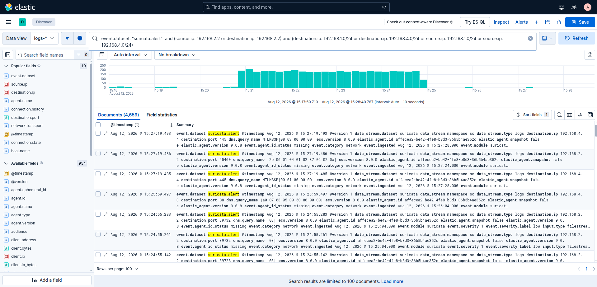

### Methodology Notes
| **Query Type** | **Query** |
|---|---|
| **Suricata Alert Query** | event.dataset: suricata.alert and source.ip: 192.168.2.2 and (destination.ip: 192.168.1.0/24 OR destination.ip: 192.168.4.0/24) |
| **Zeek Connection Query** | event.dataset: zeek.conn and source.ip: 192.168.2.2 and (destination.ip: 192.168.1.0/24 OR destination.ip: 192.168.4.0/24) |

## Section 3 - Report

### Attack Methodology and Technique
The incident consisted of a multi stage attack involving discovery scans, RDP brute force, kerberoasting, and data exfiltration through a SMB connection.

**Phase 1 (Discovery):** The attacker (PARROT or 192.168.2.2) used a stealth scan (-sS) targeting the 192.168.1.0/24 and 192.168.4.0/24 subnets and identified open ports (ShR) from online hosts shown in **Table 2.2** which aligns with **T1046 – Network Service Discovery**.

**Phase 2 (Brute Force):** The workstation (PC3-WIN or 192.168.1.12) was targeted with an RDP brute force that occured between 15:20:38 to 15:24:55, which resulted in a significantly high count of alerts. After thousands of failed attempts, the attacker was able to find the credentials of the user 'adoe' (Alice Doe), which is consistent with **T1110.001 - Brute Force: Password Guessing**.

**Phase 3 (Kerberoasting):** At about 15:25:59, the attacker used the compromised credentials of 'adoe' to authenticate to the domain controller (WIN-DC or 192.168.4.3) and perform an LDAP search for the 'svc\_fileserver' service account as shown in Screenshot 2.1. The attacker also sent a kerberos TGS-REQ for the service account, and recieved a TGS-REP from the domain controller that contains the service ticket. This algins with **T1558.003 - Steal or Force Kerberos Tickets: Kerberoasting**. The attacker can then extract and attempt to crack the service ticket of 'svc\_fileserver' offline to recover the password.

**Phase 4 (Brute Force and Lateral Movement):** The 'Data' SMB share on the fileserver (FS01 or 192.168.4.4) was accessed by the attacker with the credentials of 'svc\_fileserver' at 15:27:19 for under a second and 15:28:02 to 15:28:28 (26 seconds) as shown in **Table 2.4** and **Table 2.5**. This demonstrates further implication that **T1110.002 - Brute Force: Password Cracking** occured, and the shift in attacker's focus aligns with **T1021  - Remote Services**.

**Phase 5 (Exfiltration):** During the SMB connection, the attacker was able to exfiltrate a 20MB file (Importanti\_Info.txt) within a 26 second connection to the 'Data' share on the fileserver, which aligns with **T1048.003 - Exfiltration Over Alternative Protocol: Exfiltration Over Unencrypted Non-C2 Protocol**.

### Attacker Intent & Targeting

The attacker's activity indicates deliberate progression from reconnaissance to credential access, lateral movement, and data exfiltration. Initially, the attacker was able to identify a workstation, fileserver, and domain controller running on the network through a port scan. The workstation (PC3-WIN) was targeted because it had an exposed RDP port, which provided an opportunity for initial access via password guessing. Following the compromise of the 'adoe' account through the RDP brute-force attack, the attacker used the compromised credentials to identify the 'svc\_fileserver' service account through the domain controller. The service account was targeted using kerberoasting with the intent of obtaining higher-value credentials that could provide access to the fileserver. The subsequent access to the 'Data' SMB share indicates the attacker's intent was to expand access to the fileserver and obtain data. **Screenshots 2.6 – 2.8** provide further evidence that the attacker's intent was data exfiltration.

### Detection Analysis

**Kerberos Alert Misclassification / False Positive:** The alert "ET EXPLOIT Possible GoldenPac Priv Esc in-use" was fired, but the real attack was a Kerberosting, resulting in a false positive.

**RDP Alert Volume and Alert Fatigue:** The "ET INFO RDP – Response To External Host" alert accounted for approximately 98.6% of the alerts (4,594 alerts) during the incident, which is not ideal in this case because there is very little to learn between each alert. Each alert originated from the same source IP and targeting the same endpoint. While the volume of alerts is valuable for determining the scale of the attack, the individual alerts provide little unique information and may contribute to alert fatigue during SOC triage.

### Conclusion

The investigation determined that the incident was a successful multi-stage attack that resulted in the compromise of user and service-account credentials, unauthorized access to the fileserver, and the exfiltration of data. The evidence was sufficient to reconstruct the attack and establish a clear progression from reconnaissance through credential access, lateral movement, and data exfiltration.

The investigation also identified opportunities to improve the IDS's effectiveness. While the RDP detection provided effective visibility into the scale of the brute-force attack, it introduced alert fatigue with thousands of alerts that differed very little from each other, reducing the value of each alert. Additionally, the Kerberos activity was detected but was incorrectly classified as "Golden Privilege Escalation" rather than "Kerberoasting". Implementing a threshold to reduce repetitive RDP alerts and correcting the Kerberos detection logic would improve alert quality while maintaining visibility of malicious activity.

## Section 4 - Legend

### Table 4.1 - Connection History Legend
| **Name** | **Flags** | **Indication** |
|---|---|---|
| Sr | SYN (send) RST (receive) | Closed port |
| S | SYN (send) | Dropped or host offline |
| A | ACK (send) | Host Discovery probes |
| ShR | SYN (send), SYN-ACK(receive), RST(send) | nmap -sS (Open Port) |
| ShAR | SYN (send), SYN-ACK(receive), ACK(send), RST(send) | nmap -sT (Open Port) |

## Section 5 - IDS Remediation & Tuning

### Tuning RDP Rule
**Objective:** Limit alert fatigue by adding threshold to "ET INFO RDP – Response To External Host"

**Rule Tuning:** The rule was tuned by adding a threshold of **20 connections per 60 seconds**, tracked by source IP. After 20 matching connections are detected, an alert is triggered, and additional alerts are suppressed from the same source IP for 60 seconds while the threshold conditions remain met.

**Validation Test:** The modified rule was tested while re-simulating the RDP brute-force attack again under similar conditions. 

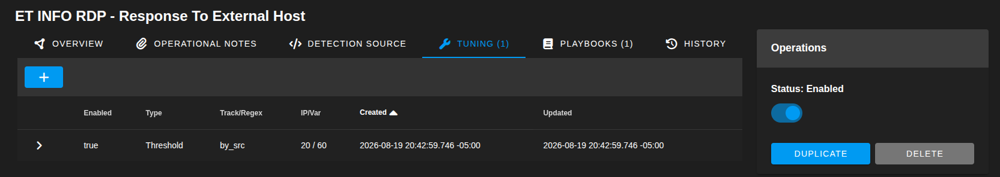

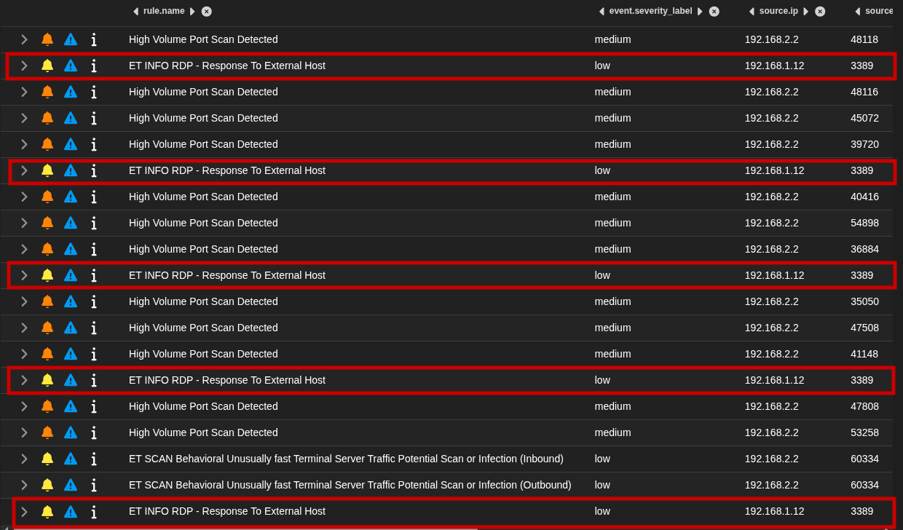

**Conclusion:** After tuning, the alert only triggered **5 times** with a total of **2,295 failed logon attempts** compared to 4,594 alerts for 2,295 atempts during the incident. This reduces the alert volume by **99.89%**, significantly reducing alert fatigue without losing visibility of the brute-force activity.

### Creating Kerberoasting Rule
**Objective:** Create a Suricata rule to detect and accurately classify Kerberoasting activity.

**Rule Creation:** The rule was created to monitor Kerberos TGS-REP packets containing the RC4-HMAC encryption type (23), which is commonly associated with Kerberoasting activity.

**Validation Test:** The new rule was validated by re-simulating the Kerberoasting attack under similar conditions and monitoring the resulting network traffic.

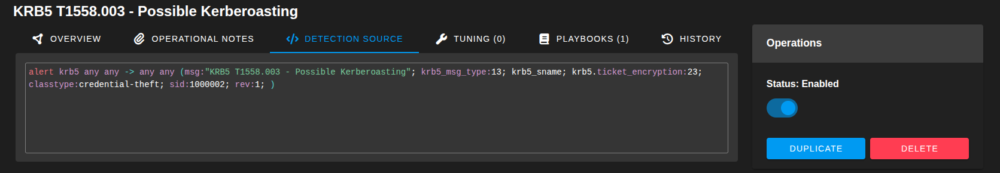

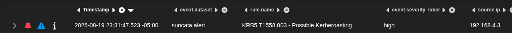

**Conclusion:** The rule successfully generated an alert during the simulated Kerberoasting attack, demonstrating that it can detect the targeted Kerberos traffic.
